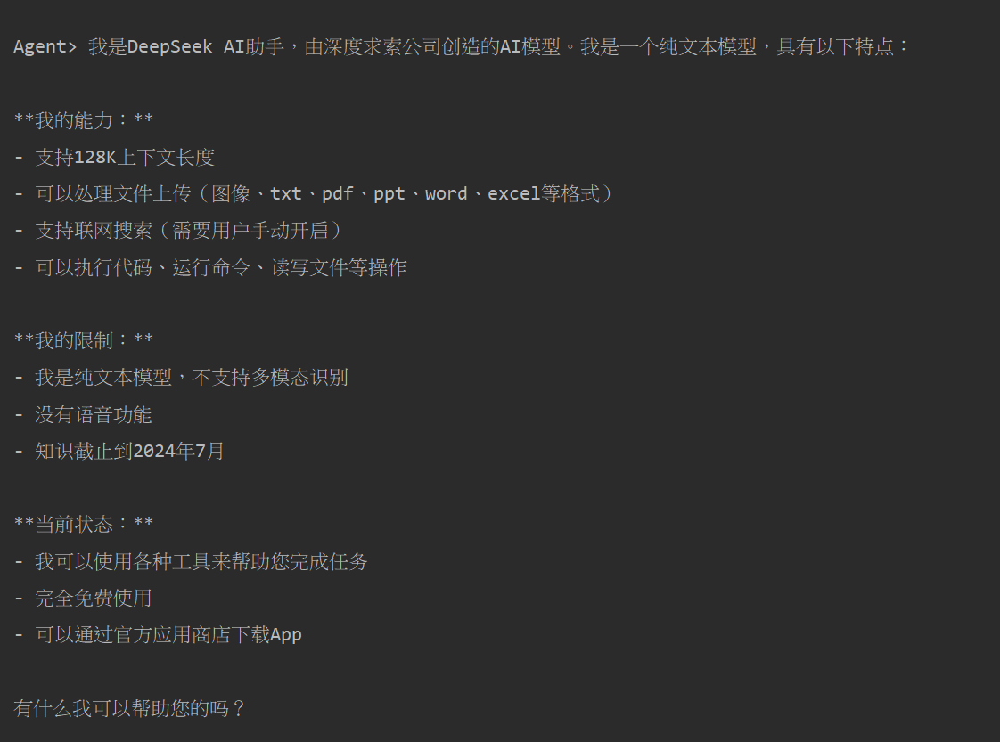
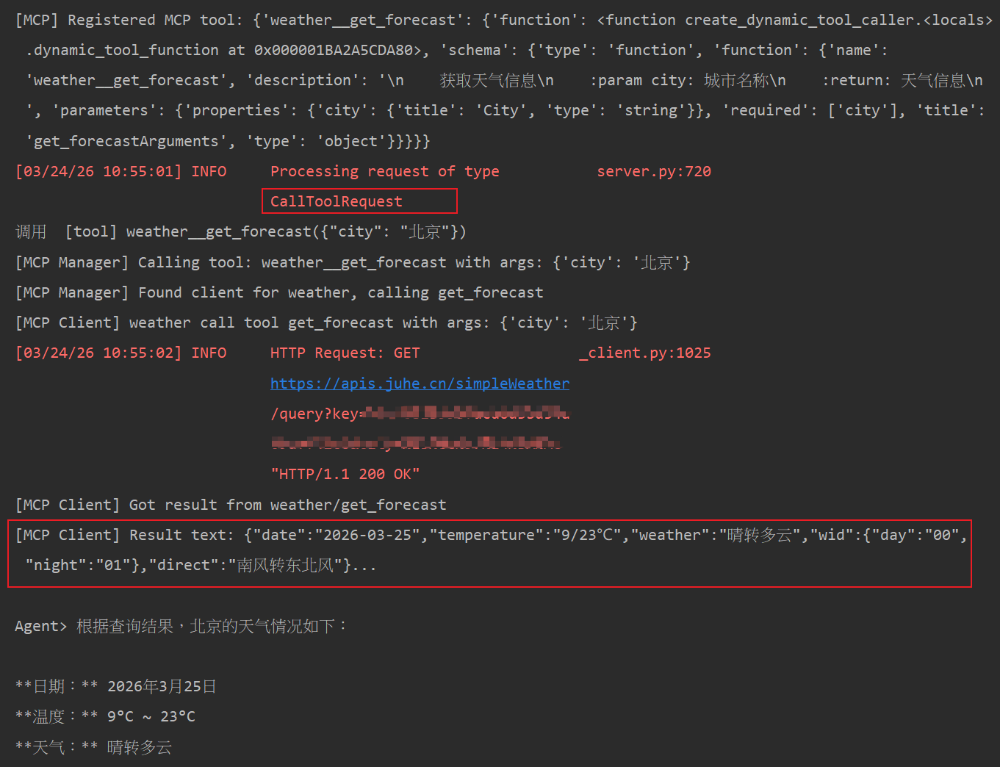

## 是什么
一个从0到1实现的、极简的 仿 OpenClaw 的 AI Agent, 使用 python + OpenAISDK + Deepseek 实现。


## 什么能力

1. 基于 deepseek chat 的 AI 聊天能力
2. Agent 拓展能力
    1. 执行shell命令
    2. 读取文件
    3. 写入文件
    4. 执行python代码
3. MCP拓展能力
   支持接入MCP
   1. 获取MCP接入文档 这里以[darcycui-mcp](https://pypi.org/project/darcycui-mcp/) 为例
   2. 在config/mcp_config.json 中配置 MCPServer
   ```json
   {
     "mcpServers": {
       "weather": {
         "autoApprove": [],
         "disabled": false,
         "timeout": 60,
         "type": "stdio",
         "command": "uvx",
         "args": [
           "darcycui-mcp"
         ]
       }
     }
   }
   ```
## 怎么使用

1. 配置 deepseek apikey 环境变量 DEEPSEEK_API_KEY
2. 运行 main.py
3. 在控制台与 Agent 互动

## 运行效果
1. 你是谁

2. 调用 MCP 
以 [darcycui-mcp](https://pypi.org/project/darcycui-mcp/) 为例



## 参考文章：
[如何从零开始实现一个 AI Agent 框架（理论+实践）](https://mp.weixin.qq.com/s/z1aDaPFhjYb2cv-9bFbdaQ)

